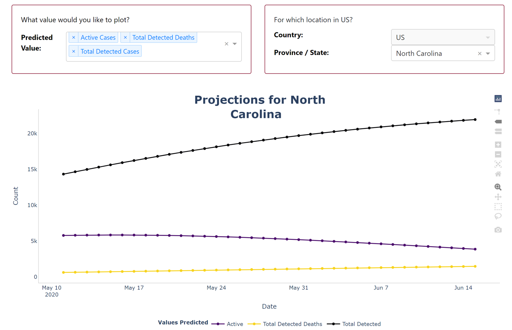
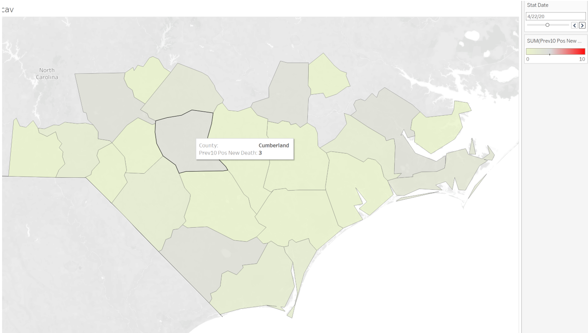
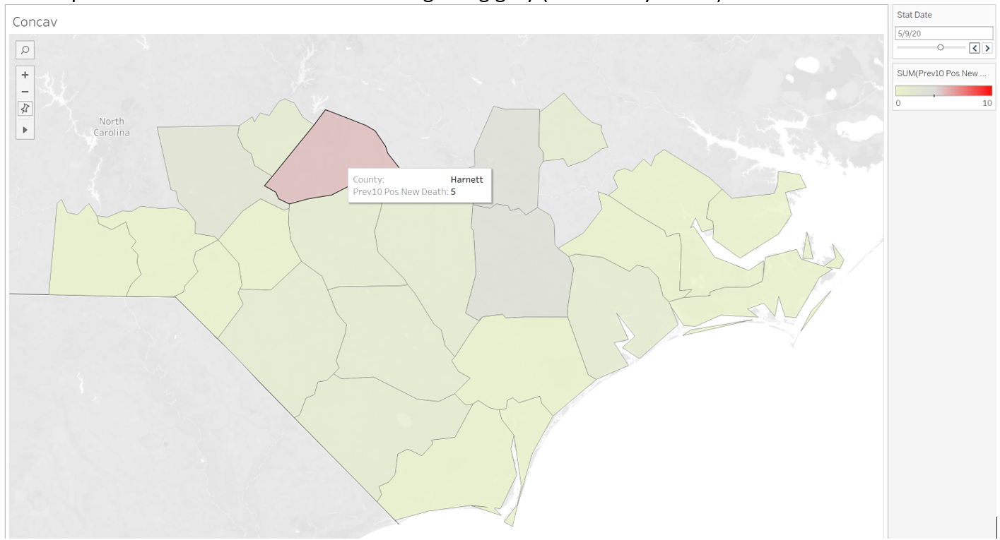
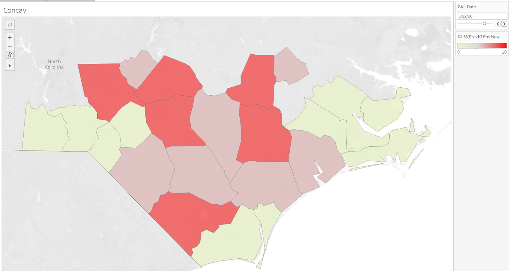

# covid
# Covid analysis for the VA (clean)
A project of InfoCorps (International Data Corps DBA InfoCorps) EIN 82-2199430

This is an excerpt from the publicly available data (no VA nor private health data is included in this repository)

Apache License 2.0 must provide credit for use. Not for resale.

Legacy Notebook for North Carolina

Contact `steve@infocorps.org`

-----------------------------------------

# Introduction
InfoCorps was contacted by the Veterans Administration to assist with a data driven investigation to determine when to begin resuming operations in their hospital system, after Covid19 related closures. The research should provide context to support the planned phased approach:
 - Phase 1 – Crimson – 20% Face to Face Urgent Primary Care
 - Phase 2 – Orange – 40% Face to Face. Primary Care + Urgent Specialty Care 
 - Phase 3 – Yellow – 60% Face to Face. Primary Care + Urgent Specialty Care + Procedures
 - Phase 4 – Blue – 80% Face to Face. Primary Care + Urgent Specialty Care + Procedures + Major Surgery
 - Phase 5 – Green – 100% New Normal Operations

InfoCorps gathered data from the VA, educational institutions and other publicly available sources to "project" statewide predictions down to the county level.

# Summary of Findings
County by county Covid19 cases (infections) are relatively low, making it difficult to predict with a high degree of accuracy. With that said we found the following:
 - Deaths (daily) reduce no more than 12.5% for the next 35 days 
 - We can say with confidence that daily deaths will not reduce more than 20% in the next 35 days in any county
 - "Opening the state up" could significantly change the predictions and render this model ineffective.
 - While we cannot state a date certain that will know when deaths are predicted to go to zero for the larger counties, we can estimate that it could happen on the following schedule (i.e. the date in which we might have a predictive model):
    - Day 0: Opening up the state or counties in NC
    - +7 days for behavior to adjust
    - +14 days incubation period
    - +7 days lag for people to seek care
    - +14 days of treatment

# Predictions
There are no predictions for cases or deaths lower than the state level. The MIT Operations Research Center publishes this model that is updated frequently. This is a new epidemiological model called DELPHI, which forecasts infections, hospitalizations, and deaths. You can think of the model as a standard SEIR model with additional features specific to the COVID-19 pandemic, like under-detection and differentiated government intervention.

# Growth Curve
A key metric that we looked at was the growth (or decline) of daily Covid19 related deaths (or cases) over the prior 10 days.

When looking at the VA "catchment area" counties, we see the following progression of deaths.
 
Yellow indicates no growth or negative growth in deaths, while red indicates positive growth in the past 10 days.

For example, on Apr 22, 2020 (actual results), Cumberland county had 3 out of 10 days of increasing growth of Covid19 related deaths, so we shade the county slightly yellow:

By May 9 2020, Harnett county went up to 5 out of 10 days of increasing growth (red) and you can see the map has a few more counties which are getting gray (on the way to red).

On May 22, there seems to be a peak in daily deaths with 6 counties having at least 8 out of 10 days of increasing deaths:

Data Sources
Total Case and Death data up to and including 6/4/20 was retrieved from the COVID-19 Data Repository by the Center for Systems Science and Engineering (CSSE) at Johns Hopkins University. For North Carolina, these numbers are retrieved from Worldometers, which in turn gets the data from the NC Department of Health and Human Services. 

From 6/5 to 7/15/20 the projections (Total Cases and Deaths) are from MIT at the NC state level. It is not exactly clear the source, but we are using the population of North Carolina at the county level from the Johns Hopkins data set.
Next Steps
It is strongly recommended that data be updated on a regular basis as the state begins to resume some "normal" operations. In addition there are opportunities to research differences between counties by using non personal testing and longitudinal data. Enhancing these "models" with more specific information from the VA hospitals could provide further insights to help with decision making.

